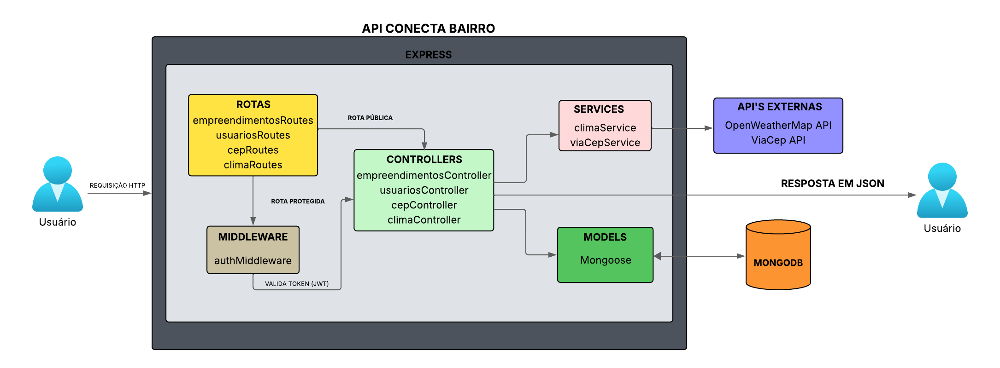

# Arquitetura do Projeto

O projeto *ConectaBairro* segue uma arquitetura inspirada em *MVC (Model-View-Controller)*, adaptada para uma API RESTful em Node.js. A estrutura foi pensada para garantir organização, escalabilidade e facilidade de manutenção.

## 📑 Sumário

1. [Estrutura de Pastas](#1-estrutura-de-pastas)  
2. [Organização por Responsabilidade](#2-organização-por-responsabilidade)  
3. [Arquivos Principais](#3-arquivos-principais)  
4. [Comunicação RESTful](#4-comunicação-restful)  
5. [Fluxo de requisição](#5-fluxo-de-requisição)    
6. [Testes Automatizados](#6-testes-automatizados)  
7. [Segurança](#7-segurança)  
8. [Diagrama da Arquitetura da API](#8-diagrama-da-arquitetura-da-api)

---

## 1. Estrutura de Pastas

plaintext
EMPREENDIMENTOSAPI/
├─ docs/
│   └─ architecture.md                  # Documentação técnica e diagramas da
                                          arquitetura
├─ node_modules/                        # Dependências instaladas via npm
├─ postman/                             # Coleções e ambientes para testes manuais
                                          da API
├─ src/
│   ├─ config/
│   │   └─ db.js                        # Conexão com MongoDB Atlas usando Mongoose
│   ├─ controllers/                     # Lógica das requisições HTTP
│   │   ├─ cepController.js             # Busca empreendimentos por CEP via ViaCEP
│   │   ├─ climaController.js           # Consulta clima atual via OpenWeather
│   │   ├─ empreendimentosController.js # CRUD de empreendimentos
│   │   └─ usuariosController.js        # Cadastro e login de usuários
│   ├─ middleware/
│   │   └─ authMiddleware.js            # Verificação de token JWT e proteção de
                                          rotas
│   ├─ models/
│   │   ├─ Empreendimento.js            # Schema do empreendimento com campos
                                          normalizados
│   │   └─ Usuario.js                   # Schema do usuário com criptografia de
                                          senha
│   ├─ routes/
│   │   ├─ cep.js                       # Rota para busca por CEP
│   │   ├─ climaRoutes.js               # Rota para consulta de clima
│   │   ├─ empreendimentos.js           # Rotas de CRUD de empreendimentos
│   │   └─ usuarios.js                  # Rotas de cadastro e login
│   ├─ services/
│   │   └─ viaCepService.js             # Serviço que consome a API ViaCEP
│   ├─ utils/
│   │   └─ funcoesUtils.js              # Funções auxiliares para filtros e
                                          normalização
│   ├─ app.js                           # Configuração principal do Express e rotas
│   └─ server.js                        # Inicialização do servidor na porta
                                          definida
├─ testes
    ├─ endpoints.test.js                # Testes automatizados com Jest e Supertest
    ├─ setupTestDB.js                   # Banco em memória para testes isolados
├─ .env                                 # Variáveis de ambiente (PORT, MONGO_URI,
                                          JWT_SECRET, OPENWEATHER_API_KEY)
├─ jest.config.js                       # Configuração do ambiente de testes
├─ package-lock.json                    # Controle de versões das dependências
├─ package.json                         # Dependências e scripts do projeto
└─ README.md                            # Documentação principal do projeto

---

## 2. Organização por Responsabilidade

| *Camada*     | *Responsabilidade*                                                                 |
|----------------|---------------------------------------------------------------------------------------|
| *Config*     | Conexão com o banco de dados MongoDB Atlas                                           |
| *Controllerr* | Lógica de negócio para cada recurso da API       |
| *Models*      | Estrutura e validação dos dados com Mongoose                           |
| *Routes*     | Mapeamento dos endpoints e ligação com os controllers                               |
| *Middleware* | Autenticação e proteção de rotas via JWT                       |
| *Services*   | Consumo de APIs externas (ViaCEP, OpenWeatherMap)                                  |
| *Utils*      | Funções auxiliares para normalização, filtros e manipulação de dados                 |
| *Tests*      | Testes automatizados com Jest, Supertest e banco em memória        |

---

## 3. Arquivos Principais

| Arquivo       | Responsabilidade                                      |
|---------------|-------------------------------------------------------|
| app.js      | Monta a aplicação, configura middlewares e rotas     |
| server.js   | Inicia o servidor e escuta a porta definida (3000)   |

---
## 4. Comunicação RESTful

A API ConectaBairro segue o padrão *REST, utilizando os métodos HTTP (GET, POST, PUT, DELETE) de forma semântica e consistente. O formato de troca de dados é **JSON*, garantindo interoperabilidade com qualquer frontend ou cliente HTTP.

### Organização das rotas por recurso

| Recurso             | Método | Endpoint                          | Descrição                                      |
|---------------------|--------|-----------------------------------|------------------------------------------------|
| *Usuários*        | GET  | /usuarios                      | Lista todos os usuários                        |
|                     | POST | /usuarios/login                | Autentica o usuário e retorna o token JWT      |
| *Empreendimentos* | GET  | /empreendimentos               | Busca empreendimentos com filtros              |
|                     | POST | /empreendimentos               | Cadastra novo empreendimento (rota protegida)  |
|                     | PUT  | /empreendimentos/:id           | Edita empreendimento (rota protegida)          |
|                     | DELETE| /empreendimentos/:id          | Remove empreendimento (rota protegida)         |
| *CEP (ViaCEP)*    | GET  | /externo/cep/:cep              | Consulta endereço por CEP via API ViaCEP       |
| *Clima (OpenWeather)* | GET | /api/clima?cidade=Fortaleza | Consulta clima atual da cidade via OpenWeather |

---

### Convenções adotadas

- Os endpoints seguem o padrão de pluralização (/usuarios, /empreendimentos)
- Parâmetros dinâmicos são indicados com :id ou :cep
- Filtros são passados via query string (?cidade=Fortaleza)
- Rotas protegidas exigem token JWT no header:  
  Authorization: Bearer <seu_token>

## 5. Fluxo de requisição

Abaixo está o caminho completo que uma requisição percorre dentro da API ConectaBairro, incluindo os pontos de decisão para rotas públicas e protegidas.

plaintext
Usuário → Express (Rotas) → [Se protegida? → authMiddleware (JWT) → OK? → Controller] → Services (se necessário) → APIs externas (se necessário) → MongoDB → Controller → Resposta JSON → Usuário

### Etapas do fluxo
Entrada: O usuário envia uma requisição HTTP (GET, POST, PUT, DELETE).

- Express/Rotas: O Express recebe a requisição e a roteia para o endpoint correspondente.

- Proteção (se aplicável): Se a rota for - protegida, o authMiddleware valida o token JWT.

- Controller: Executa a lógica de negócio do endpoint.

- Services: Se necessário, o controller chama services para consumir APIs externas (ViaCEP, OpenWeather).

- Banco de dados: O controller consulta ou persiste dados no MongoDB (via Mongoose).

- Montagem da resposta: O controller consolida dados (banco + externos) e retorna JSON ao usuário.

### Fluxo de rota pública

plaintext
Usuário → Express/Rotas → Controller → [Services/APIs externas?] → MongoDB → Controller → Resposta JSON → Usuário

### Fluxo de rota protegida

plaintext
Usuário → Express/Rotas → authMiddleware (JWT) → Controller → [Services/APIs externas?] → MongoDB → Controller → Resposta JSON → Usuário

- Validação JWT: O middleware busca o token no header:

Authorization: Bearer <seu_token_jwt>

- Comportamento: Se o token for válido, o middleware anexa os dados do usuário a req.usuario e chama next(); se inválido, responde 401/403 e interrompe o fluxo.

## 6. Testes Automatizados

- Jest + Supertest: para testes unitários e de integração

- MongoMemoryServer: simula o banco em memória para testes confiáveis

Testes cobrem:

- Cadastro e login de usuários

- CRUD de empreendimentos

- Proteção de rotas

- Integração com ViaCEP e OpenWeather

## 7. Segurança

- Autenticação via JWT

- Proteção de rotas sensíveis com middleware

- Uso de .env para esconder credenciais

- Validação de entrada nos controllers

## 8. Diagrama da Arquitetura da API

